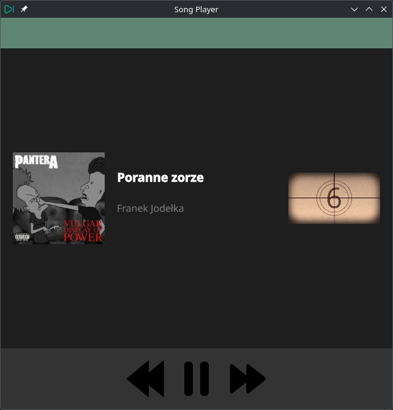

# Qt_MusicPlayer

Qt_MusicPlayer to prosty odtwarzacz muzyki stworzony z użyciem C++
(backend) oraz QML (interfejs). Projekt bazuje na tutorialu i służy jako
dobry punkt startowy do nauki integracji Qt 6 + QML + C++.

# Spis treści

-   Funkcjonalności
-   Technologie
-   Instalacja i budowanie
-   Uruchamianie
-   Struktura projektu
-   Plany na przyszłość
-   Licencja

# Funkcjonalności

-   Wczytywanie plików audio (np. MP3, WAV)
-   Odtwarzanie, pauza, wznawianie
-   Przejście do następnego/poprzedniego utworu
-   Wyświetlanie podstawowych informacji o pliku audio (np. tytuł,
    wykonawca)
-   Prosta, responsywna warstwa interfejsu z QML

# Technologie

-   C++ (backend)
-   QML (UI)
-   Qt 6 framework
-   CMake jako system budowania
-   (Opcjonalnie) komponenty multimedialne Qt

# Instalacja i budowanie

1.  Sklonuj repozytorium:
    git clone https://github.com/r‑lapins/Qt_MusicPlayer.git
    cd Qt_MusicPlayer
2.  Utwórz katalog budowania i skonfiguruj projekt CMake:
    mkdir build && cd build
    cmake ..
3.  Zbuduj projekt:
    cmake –build .

# Uruchamianie

Po ukończeniu budowania uruchom wygenerowany plik binarny (np.
Qt_MusicPlayer).

# Struktura projektu

/assets/ – zasoby
/qml/ – interfejs QML
AudioInfo.cpp/.h – metadane audio
PlayerController.cpp/.h – logika odtwarzacza
main.cpp – punkt wejścia
CMakeLists.txt – konfiguracja
.gitignore
README.md

# Plany na przyszłość

-   Playlisty
-   Shuffle / repeat
-   Biblioteka muzyczna
-   Więcej formatów
-   Poprawa UI

# Licencja

MIT (or no license).
