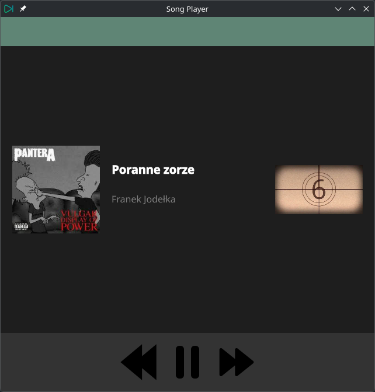
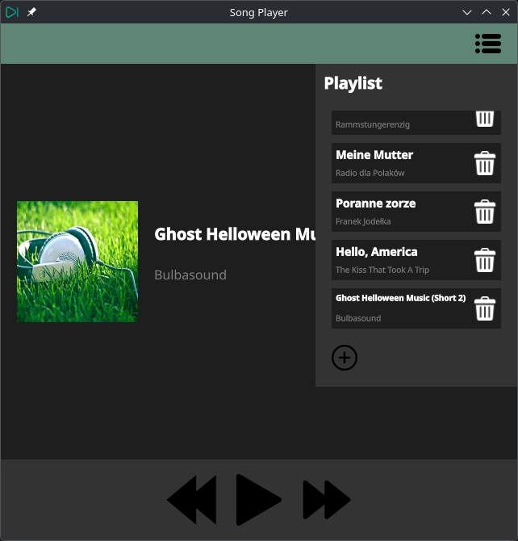
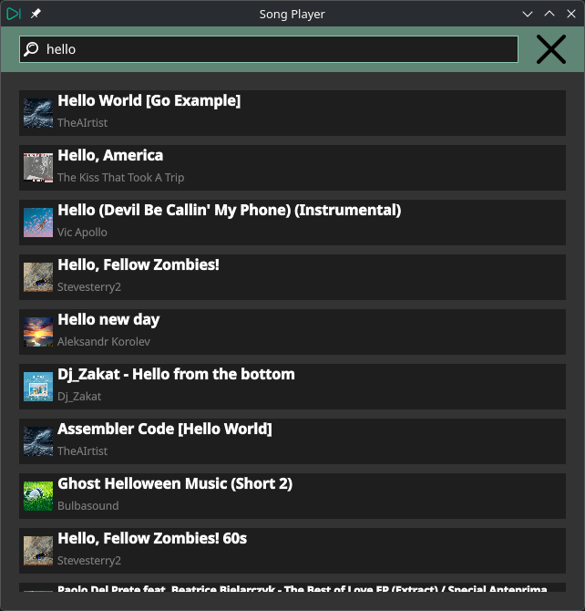

# Qt_MusicPlayer





Qt_MusicPlayer is a desktop music player application built with **Qt 6 (C++ + QML)**.  
The project demonstrates integration between native C++ backend logic and a modern QML user interface, including playlist management and REST API communication.

Originally developed while following a Qt/QML tutorial, the project required adjustments for newer Qt 6 versions.


---

# Project Overview

This application demonstrates:

- Separation between QML presentation layer and C++ model/controller layer
- Use of `QAbstractListModel` to expose C++ models to QML
- REST API communication using `QNetworkAccessManager`
- JSON parsing using Qt JSON utilities
- Playlist management and dynamic model updates
- Modular QML component design

The project focuses on understanding how real-world Qt applications are structured and how backend logic can be exposed efficiently to a declarative UI.

---

# Key Features

## Local Audio Player
- Load local audio files (MP3, WAV)
- Play / Pause / Resume
- Next / Previous navigation
- Display basic metadata (title, artist)

## Playlist System (Model/View Architecture)
- `PlayerController` derived from `QAbstractListModel`
- Internal `QList<AudioInfo>` used as playlist container
- Add / remove tracks dynamically
- Play track by index
- Playlist rendered in QML using `ListView`
- Full C++ ↔ QML data binding

## Online Music Search (REST Integration)
- Integration with **Jamendo Public REST API**
- HTTP requests handled via `QNetworkAccessManager`
- Asynchronous response handling with signals/slots
- JSON parsing using:
  - `QJsonDocument`
  - `QJsonObject`
  - `QJsonArray`
- Custom `AudioSearchModel` exposed to QML
- Search results displayed in QML ListView
- Add online tracks directly to playlist

---

# Architecture

The project follows a simplified layered architecture:

UI Layer (QML)
↓
C++ Models (QAbstractListModel)
↓
Media / Networking Layer
↓
Qt Framework (Multimedia, Network)

Main components:

- `PlayerController`  
  Playlist model + playback control logic.

- `AudioSearchModel`  
  Stores and exposes REST search results to QML.

- `AudioInfo`  
  Data structure representing audio metadata.

- QML Panels  
  - PlaylistPanel  
  - SearchPanel  
  - Reusable UI components

This architecture ensures:
- Clear responsibility separation
- Reactive UI updates via Qt's Model/View system
- Testable backend logic independent from UI

---

# Technologies Used

- **C++17**
- **Qt 6**
- QML
- Qt Multimedia
- Qt Network
- QAbstractListModel
- QNetworkAccessManager
- JSON handling (Qt JSON API)
- CMake

---

# Build Instructions

### 1. Clone the repository

```
git clone https://github.com/r-lapins/Qt_MusicPlayer.git
cd Qt_MusicPlayer
```

### 2. Configure the project

```
mkdir build && cd build
cmake ..
```

### 3. Build

```
cmake --build .
```

---

# Running

After building:

```
./Qt_MusicPlayer
```

(On Windows, run the generated `.exe` file.)

---

# Project Structure

```
/assets/                    # Icons and UI resources
/qml/                       # QML UI components

AudioInfo.h/.cpp            # Audio metadata representation
PlayerController.h/.cpp     # Playlist model + playback logic
AudioSearchModel.h/.cpp     # REST search results model

main.cpp                    # Application entry point
CMakeLists.txt              # Build configuration
README.md
```

---

# What This Project Demonstrates

- Practical understanding of Qt Model/View architecture
- Real-world C++ ↔ QML integration
- Asynchronous networking in Qt
- JSON parsing and data mapping
- Designing modular UI in QML
- Clean separation of concerns in desktop applications

---

# Possible Future Improvements

- Shuffle / repeat modes
- Network error handling improvements
- Caching of search results
- Refactoring networking into dedicated service layer
- Unit testing for models
- UI/UX refinements

---

# License

MIT
